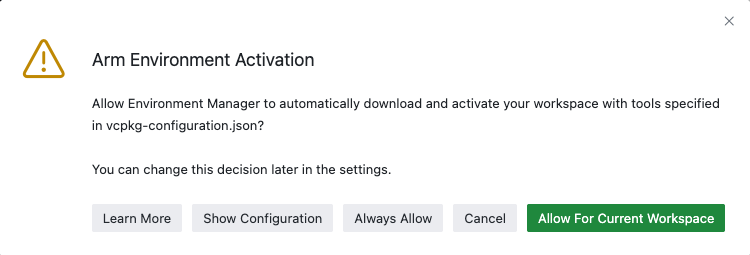
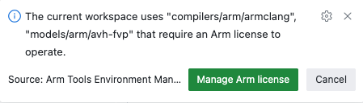
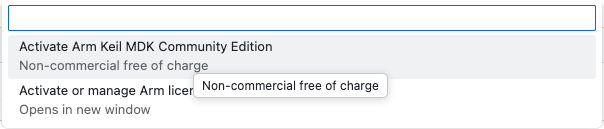

# Hello, Codespaces

This repository builds an ELF file that prints "Hello, Codespaces!" and a counter value via semihosting output on an
Arm FVP simulation model (Cortex-M3).

## Quick Start

1. Click on **Use this Template** (in the top right corner) and select **Create a new Repository**.
2. Enter a name for the new repository and click on **Create repository**. The new repository opens in your browser.
3. Click on the drop down next to **<> Code** and select **Codespaces**.
4. Click on **Create codespace on main**.

> [!NOTE]
> The first time you create the Codespace will take a while as it installs the tools as described in the
> [`devcontainer.json`](.devcontainer/devcontainer.json) file.

During the process, you will see a pop up like this:



Click on **Allow For Current Workspace**. This will install the tools specified in the
[`vcpkg-configuration.json`](./vcpkg-configuration.json) file automatically into your codespace.

When the installation finishes, you will see a pop up in the bottom right corner:



Click on **Manage Arm license** to select from the available options. For evaluation purposes, you can use the Arm Keil
MDK-Community edition:



> [!NOTE]
> If you missed the pop up, you can activate a license by clicking on the
>  notification in the status bar.

## Build and Run

The project is configured for execution on an Arm Cortex-M3 FVP. Using a model removes the requirement for a physical
hardware board. This enables software testing directly on GitHub repositories.

1. Open the  **CMSIS** view.
2. If the current target set context **avh** in the status bar shows a red background, click on the three dots and
   select **Refresh (reload packs, update RTE). This will trigger a project update with the arm tool license
   you have added previously.
3. Click on  **Build solution** to start the build process. The build should finish
   without errors or warnings.
4. Click on  **Load & Run application** to run the image on the simulation model. The
   **tTerminal** shows the output `Hello, Codespaces! XX`.

> [!NOTE]
> The simulation stops automatically after 120 seconds runtime.

## Repository Structure

```txt
  📦
  ┣ 📂 .devcontainer                    Development container control files
     ┗ 📄 devcontainer.json              Installs the required VS Code extensions (Keil Studio Pack)
  ┣ 📂 .vscode                          VS Code specific settings files
     ┗ 📄 tasks.json                     Contains the load & run command the starts the Arm FVP model
  ┣ 📂 hello                            Project files
     ┣ 📂 RTE                            Run-time environment related files
     ┣ 📄 hello.cproject.yml             Project file in CMSIS solution format
     ┗ 📄 main.c                         C code
  ┣ 📂 images                           Images for this README.md file
  ┣ 📄 .gitignore                       List of files not to be committed to Git
  ┣ 📄 fvp-config.txt                   Arm FVP configuration file 
  ┣ 📄 hello_codespaces.csolution.yml   CMSIS Solution file 
  ┣ 📄 LICENSE                          Apache 2.0 license file
  ┣ 📄 README.md                        This file
  ┗ 📄 vcpkg-configuration.json         Tools configuration file
```
